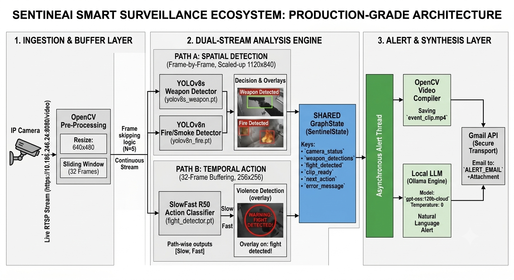

# 🚀 SentinelAI: Multi-Model Autonomous Smart Surveillance & Threat Action System

An enterprise-grade, **AI-powered smart surveillance and automated response system** that detects critical security threats—including **weapons, fire/smoke, and violent physical altercations (fight detection)**—in real-time using hybrid Deep Learning pipelines. Upon threat validation, the system orchestrates local LLMs to synthesize urgent situational context and dispatches **automated email alerts containing recorded video evidence** using the Gmail API.

---

## 🧠 Project Architecture & Workflow

This system integrates spatial frame-level object detectors with temporal video classification networks into a synchronized real-time processing pipeline:




## 🚀 Key Technical Features

* **Hybrid Real-Time Inference:** Orchestrates multiple neural networks simultaneously using localized frame-skipping optimizations to maintain a stable 30+ FPS stream.
* **Dual-Stream Temporal Processing:** Employs a 3D CNN (SlowFast R50) over an active frame-buffer window to classify complex dynamic actions (violence/fights) rather than relying on static images.
* **Generative AI Alerts:** Interfaces with local LLMs via Ollama to dynamically synthesize varied, human-grade emergency dispatch text rather than hardcoded templates.
* **Automated Evidence Capture:** Spawns asynchronous worker threads to dump buffered frames into an encoded video clip upon event trigger, pushing it instantly to security channels.

---

## ⚙️ Technologies & Core Stack

* **Core Engine:** Python, OpenCV, PyTorchVideo
* **Computer Vision Frameworks:** PyTorch, Ultralytics YOLOv8 (v8s/v8n architectures)
* **Action Recognition:** SlowFast R50 Network (ResNet-50 Backbone)
* **GenAI Orchestration:** Ollama API Interface
* **Automation Infrastructure:** Gmail API Client, MIME multi-part protocol

---

## 🧩 Model Specifics & Configurations

### 🔹 1. Frame-Level Object Detection (YOLOv8)
* **Weapons Architecture:** `YOLOv8s` fine-tuned on a custom bounding-box dataset containing various firearm and edge-weapon geometries.
* **Environmental Hazard Core:** `YOLOv8n` optimized specifically for high-recall localized fire and smoke atmospheric characteristics.

### 🔹 2. Temporal Action Classifier (SlowFast)
* **Backbone Network:** `SlowFast R50` tracking fast spatial changes along the fast pathway and stable background spatial semantics along the slow pathway.
* **Target Vectors:** Binary Output Vector `[0: Non-Fight, 1: Physical Altercation]`.

---

## ⚙️ Installation & Workspace Setup

### 1. Clone the Infrastructure
```bash
git clone [https://github.com/Abdul-Hamidd/SentinelAI--Smart-Surveillance-System.git](https://github.com/Abdul-Hamidd/SentinelAI--Smart-Surveillance-System.git)
cd SentinelAI--Smart-Surveillance-System
2. Dependency Resolution
Ensure you have a working C++ compiler and CUDA environment configured before building PyTorch-dependent layers:

Bash
pip install -r requirements.txt
3. Environment Configurations
Create a .env file in the root directory to store secure parameters:

Code snippet
SENDER_EMAIL=your_security_gateway@gmail.com
RECEIVER_EMAIL=admin_dashboard@domain.com
OLLAMA_MODEL=llama3
▶️ Operational Execution
Live Inference (Camera/CCTV Feed IP)
To spin up the dynamic pipeline capturing from the default local index or custom network RTSP stream:

Bash
python inference.py
📧 Enterprise Email Alert Setup
Head to the Google Cloud Console, spin up a project, and enable the Gmail API.

Configure your OAuth consent screen and generate Desktop Application Credentials.

Download the credential payload, rename it to credentials.json, and place it securely in the root directory of this repository.

On the initial pipeline bootstrap, an authentication window will launch to produce a secure, cached token (token.pickle) for subsequent headless executions.

🤖 LLM Engine (Ollama Integration)
The automated dispatcher uses an isolated local LLM to prevent outbound data leakage of surveillance frames while generating contextual dispatches.

Default Active Model: llama3 (or mistral) managed locally via Ollama.

Ensure the service background daemon is running prior to pipeline execution:

Bash
ollama run gpt-oss:120b-cloud
🧪 Training Architecture Overview
Spatial Layers (YOLOv8 Models)
Hyperparameters: AdamW Optimizer, Initial Learning Rate 10 
−3
 , 300 Train Epochs.

Regularization: Extensively mixed Mosaic and MixUp augmentations to eliminate environmental over-fitting.

Temporal Layers (SlowFast Model)
Methodology: Transfer Learning over Kinetics-400 pretrained structures.

Convergence Control: Configured with Early Stopping pacing validation loss over 10 check intervals.

⚠️ Repository Notes
Production network weights (.pt files) are excluded from the main branch trees due to large tracking sizes. Place custom-trained weight models into a /weights directory prior to initialization.

🌟 Strategic Roadmap
[ ] React-based Enterprise Web Dashboard for multi-grid live stream feeds.

[ ] Asynchronous distributed camera ingestion via Celery/Redis tasks.

[ ] Native Webhook notifications for Slack and Discord enterprise APIs.

👨‍💻 Author
ABDUL HAMID GenAI & AI/ML Engineer linkedin.com/in/abdul-hamid786 | wellfound.com/u/abdul-hamid-29 | https://www.kaggle.com/hamidai

Give it a star ⭐ on GitHub if you find this architecture useful!
